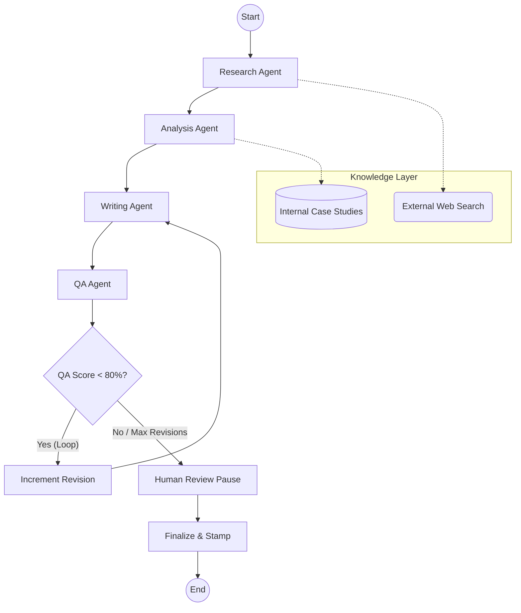

# 🚀 B2B Proposal Generator

An enterprise-grade multi-agent AI system designed to automate the end-to-end creation of high-impact B2B proposals. By combining specialized AI agents with RAG (Retrieval-Augmented Generation), this system delivers data-driven, client-ready proposals in minutes.

---

## 🎯 What We Are Solving
In the B2B world, crafting a winning proposal is often a manual, high-friction process that takes days:
- **Information Overload**: Sales teams spend hours digging through case studies and websites.
- **Inconsistency**: Manual drafting leads to varied quality and missed brand standards.
- **Slow Turnaround**: Review loops between research, writing, and QA create bottlenecks that lose deals.

---

## 💡 What This Project Is
The **B2B Proposal Generator** is a "Sales Engineer in a Box." It uses a directed graph of AI agents to:
1.  **Research** your prospect instantly using real-time web search.
2.  **Analyze** internal case studies to find the perfect value match.
3.  **Draft** a complete, hyper-personalized proposal.
4.  **Audit** the output through a rigorous QA loop before you even see it.

---

## 🛠️ Our Approach: The Multi-Agent Pipeline
We don't just "ask a chatbot" to write a proposal. We use **LangGraph** to orchestrate a specialized team:

- **Collaborative Intelligence**: Four distinct agents (Research, Analysis, Writer, and QA) handle specific parts of the workflow.
- **Memory & Persistence**: Every job is saved to a database, allowing you to pause, resume, or restart generations at any time.
- **Fact-Grounded RAG**: Integrated with **ChromaDB** for internal knowledge and **Tavily** for external market data.
- **Human-in-the-Loop**: A built-in checkpoint system allows humans to review and provide feedback before the final export.

### 🔄 System Architecture


---

## 🚀 Getting Started

### 1. Prerequisites
- **Node.js** (for Frontend)
- **Python 3.10+** (for Backend)
- **API Keys**: OpenRouter (LLM) and Tavily (Search)

### 2. Backend Setup
```bash
# Navigate to root
cd b2b-proposal-generator

# Setup environment
source venv/bin/activate
cp .env.example .env  # Add your keys here

# Start the API
python scripts/run_api.py
```

### 3. Frontend Setup
```bash
# Navigate to frontend
cd frontend

# Install & Run
npm install
npm run dev
```
Visit `http://localhost:3000` to start generating.

---

## 🔮 Future Roadmap

- **🎨 Multi-Format Export (PPTX/DOCX)**: Go beyond PDF and Markdown. Generate full-blown sales decks and Word documents ready for final formatting.
- **✍️ Section-Level Re-writes**: Don't like one paragraph? Highlight it and ask the agent to rewrite just that section using a different "tone" or data point.

---
*Built with ❤️ for High-Performance Sales Teams.*
